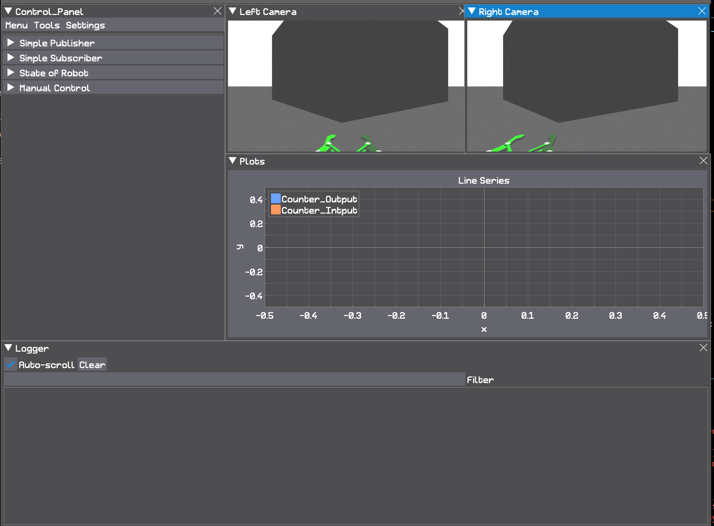

# dearpy-ros
This repository serves as a contemporary and customizable graphical user interface (GUI) designed to control mobile robots within the context of the Robot Operating System (ROS). The GUI is constructed using the Dearpygui package, offering a user-friendly interface that facilitates seamless interaction with and command of mobile robots. Its modern design and customization options make it a versatile tool for managing various aspects of robot behavior and functionality, enhancing the overall user experience in the field of robotic control and navigation.

